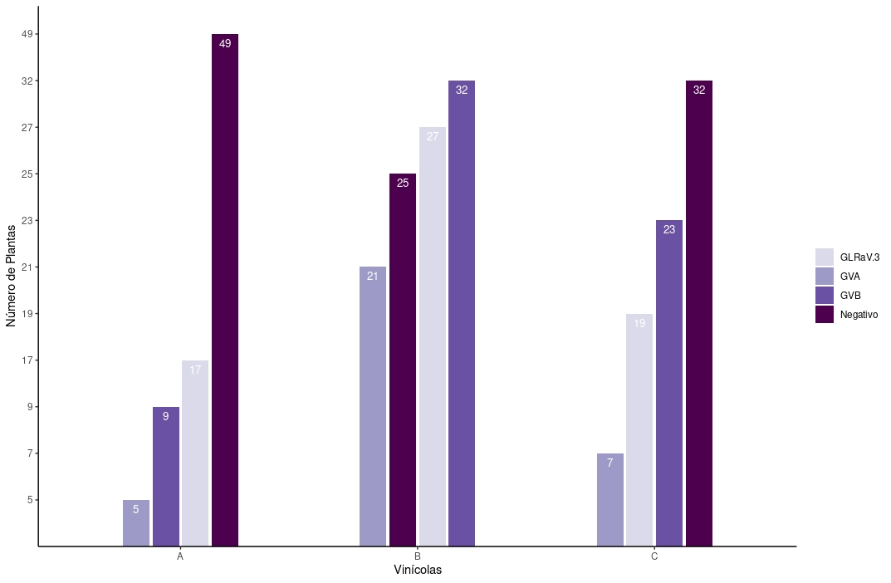
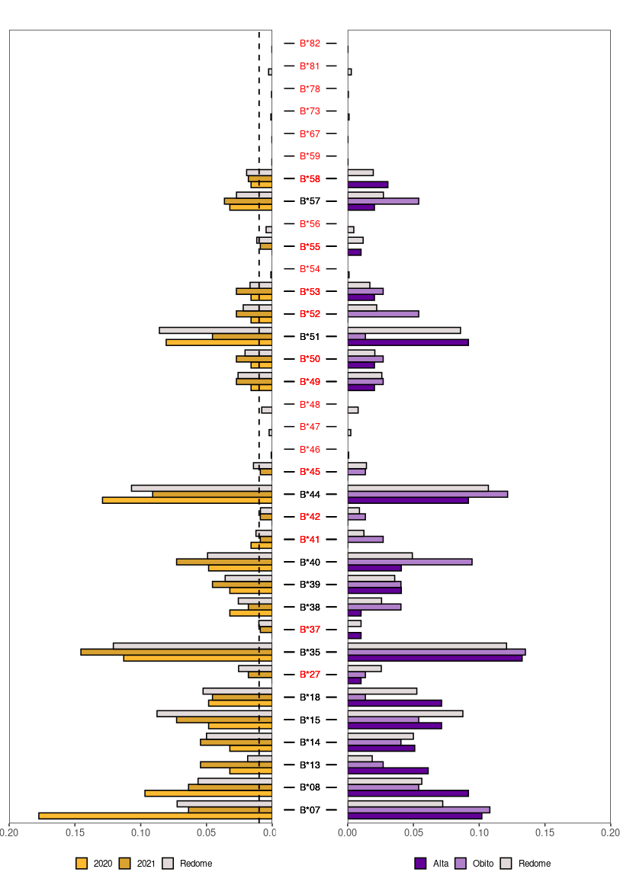
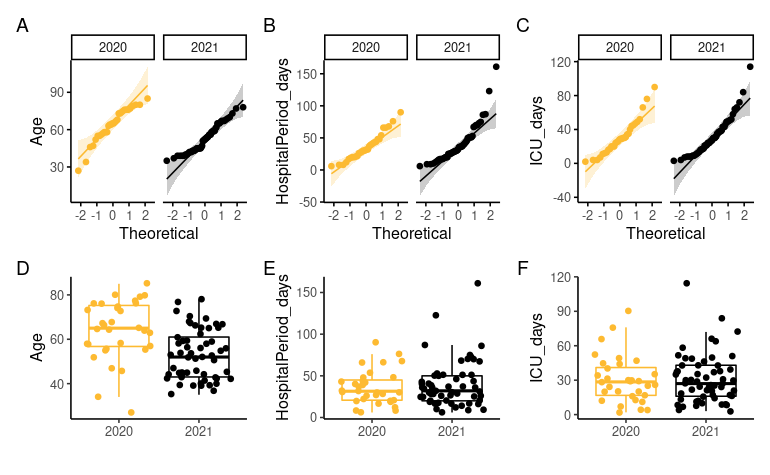
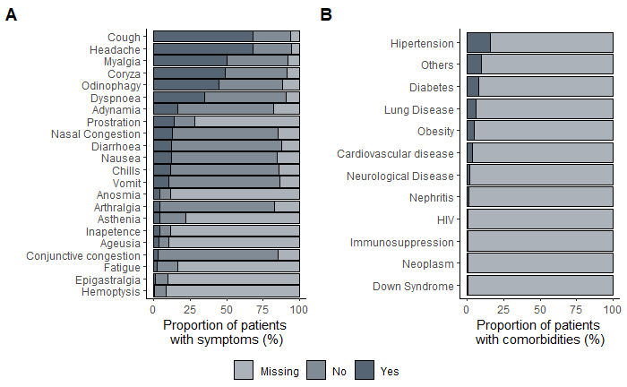
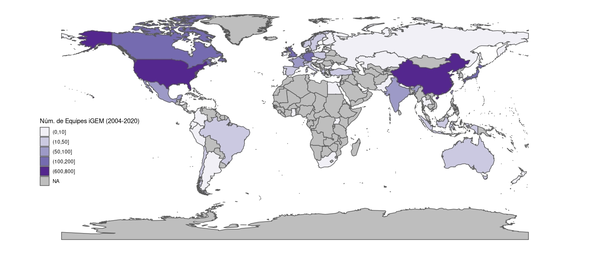
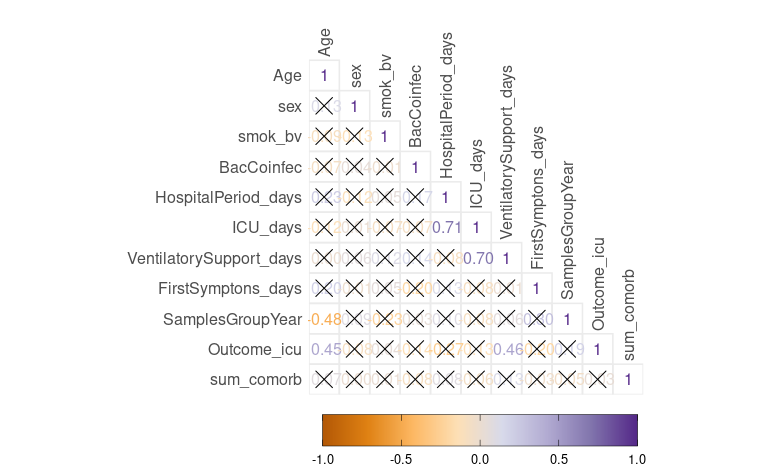
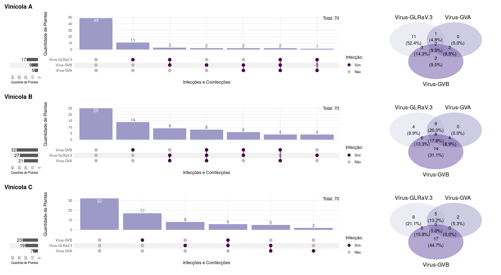

# About me: **Samuel C.**

**Undergraduate Student | BSc. in Biotechnology | [CV Webpage](../index.html)**

I am a Biotechnology undergraduate student working with data analysis for biological data (focus on Bioinformatics pipelines). Recently, from my experience with web scraping and data visualization in research projects, I started to provide freelance services and specialize as a data analyst. I aim to identify the specific features for each task, accomplished through communication with the client/colleagues and dedication to delivering impact results. Most importantly, as a data analyst in formation, I always seek to learn new tools/packages contributing to diversifying results for each project.

Languages that I am working with:   

- R

- Python

- Bash

**My Services:**

- Data Visualization

- Data Cleaning

- Statistical Descriptive/Exploratory Analysis

- Web Scraping

- Automation Scripts (Python/R)

- Data Collection (ETL)

---

# DataViz

## Simple Graphs

Bar Charts             |  Customized Bar Charts
:-------------------------:|:-------------------------:
  |  

 
Faceted Charts      |  
:-------------------------:|:-------------------------:
  |  

## Interactive Graphs

* [3D Graph](./Images/Image7.html)

* [Heatmap Graph](./Images/Image9.html)

* [Bar Chart Graph](./Images/Image10.html)

## Interesting Graphs

Map Charts             |  Correlation Charts
:-------------------------:|:-------------------------:
  |  

Venn Diagram Variations             |  Statistical Modeling Charts 
:-------------------------:|:-------------------------:
 |  

---

